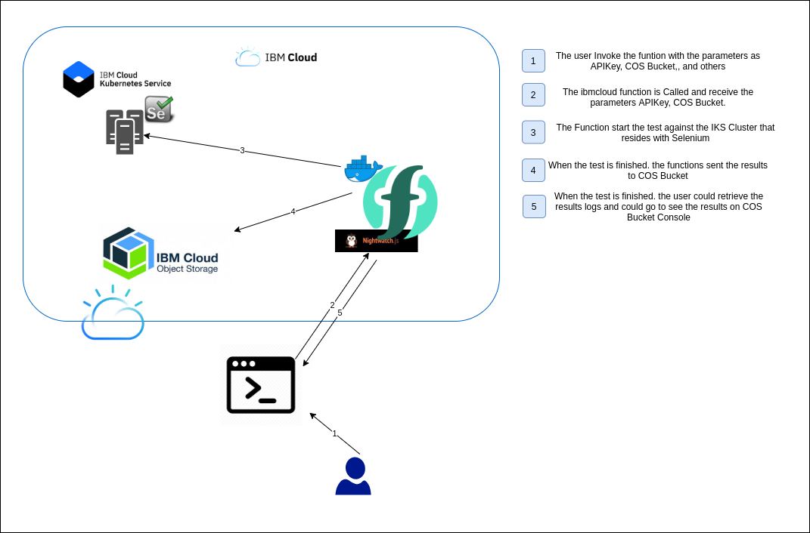

# Cloud Function for IBM Cloud, Running Nightwachtjs Test.

This directory contains the instructions and artifacts to deploy a Function on IBM Cloud, that will run a NightwatchJS test in a Selenium Grid host.

## Overview and Architecture:
Built using IBM Cloud, the application uses
* [Object Storage](https://cloud.ibm.com/objectstorage/create)
* [Functions](https://cloud.ibm.com/functions/)
* [API Key](https://cloud.ibm.com/iam/apikeys)
* [IBM Kubernetes Service - IKS](https://cloud.ibm.com/kubernetes/clusters)
 

## Pre-requisites:
* Docker
* Docker Hub Account (Optional)
* ibmcloud CLI
* Selenium-grid host (optional follow the instructions on [This blog](https://medium.com/juanjosepb/selenium-grid-running-on-ibm-cloud-kubernetes-service-iks-f65b6bf699fc) to deploy a selenium)
* Create a bucket on [Object Storage](https://cloud.ibm.com/objectstorage/create)
* Create a Namespace on [Functions](https://cloud.ibm.com/functions/)
* A Valid [API Key](https://cloud.ibm.com/iam/apikeys)

## Function parameters:
inside the repository folder make a copy of `parameters-template.json` and set values of the parameters, the new file could be called `parameters.json`:
- `SELENIUM_HOST_ADDRESS` if you have a Remote selenium, add the ip address or dns (default localhost)
- `SELENIUM_PORT` if you have a Remote selenium, add the port (default 4444)
- `API_KEY` APIKEY generated on IAM Cloud to allow upload the results.
- `NAME_OF_BUCKET` bucket name to upload the results on IBM Cloud
- `REGION` Region of the bucket creation.
- `BUCKET_PATH_TEST` (Optional) If the nightwatch test was uploaded to a Bucket folder. by default is a test inside the folder (cloud_function/nightwatch/tests/test-autopractice.js) but is commented on the Dockerfile.

## 1. Optional: Build and publish cloud function docker image using `script-build.sh`
This creates a new docker image with all required dependencies and packages and the according client code to invoke the. You only need to do this if you made changes to `OWN_DOCKER_HUB_REPOSITORY` in this script `script-build.sh`. You will then also need to adapt the `script-register.sh` script to reference your own pushed docker image (there is a default with a functional image).

## 2. Register the Nightwatchjs cloud function using `script-register.sh`
This registers a Cloud Function called `nightwatchfunction` inside your IBM Cloud org and space.

## 3. Call the function with the parameters file `script-call.sh`
This calls the function with a file passing to the function parameters. You can change the statements text to any other statement that works for you and your data in the file `parameters.json` mentioned in above steps.

**Note**: To work with this tasks you need to be logged with the right permissions with the CLI `ibmcloud` 

### To get more information
In this [Repository k8s-selenium-grid](https://github.com/juanjopb/k8s-selenium-grid) you could get more information about Selenium Grid installation.
